# Contenido

- [Contenido](#contenido)
- [Guía básica](#guía-básica)
  - [Requisitos](#requisitos)
    - [Herramientas opcionales recomendadas](#herramientas-opcionales-recomendadas)
  - [Conceptos básicos](#conceptos-básicos)
    - [¿Qué es GIT?](#qué-es-git)
    - [¿Por qué debemos usar Git?](#por-qué-debemos-usar-git)
    - [Principales comandos para trabajar con Git](#principales-comandos-para-trabajar-con-git)
      - [Git Init](#git-init)
      - [Git Clone](#git-clone)
      - [Git Add](#git-add)
      - [Git Commit](#git-commit)
      - [Git Remote](#git-remote)
      - [Git Status](#git-status)
      - [Git Pull](#git-pull)
      - [Git Push](#git-push)
      - [Git Merge](#git-merge)
      - [Git Branch](#git-branch)
      - [Git Checkout](#git-checkout)
  - [Nomenclatura (buenas prácticas)](#nomenclatura-buenas-prácticas)
    - [Nomenclatura de Ramas](#nomenclatura-de-ramas)
    - [Nomenclatura de commits](#nomenclatura-de-commits)
  - [Ejercicios prácticos](#ejercicios-prácticos)
    - [Iniciar un proyecto](#iniciar-un-proyecto)
      - [Inicializar un proyecto desde la terminal (git bash)](#inicializar-un-proyecto-desde-la-terminal-git-bash)
      - [Inicializar un proyecto desde VS Code](#inicializar-un-proyecto-desde-vs-code)
      - [Inicializar un proyecto usando Git Tortoise](#inicializar-un-proyecto-usando-git-tortoise)
    - [Clonar un repositorio existente de GitHub en tu máquina local](#clonar-un-repositorio-existente-de-github-en-tu-máquina-local)
      - [Clonar un repositorio existente desde la terminal (git Bash)](#clonar-un-repositorio-existente-desde-la-terminal-git-bash)
      - [Clonar un repositorio existente desde desde VS Code](#clonar-un-repositorio-existente-desde-desde-vs-code)
      - [Clonar un repositorio existente usando Git Tortoise](#clonar-un-repositorio-existente-usando-git-tortoise)
    - [Crear una nueva rama](#crear-una-nueva-rama)
    - [Añadir cambios a una rama ( commit )](#añadir-cambios-a-una-rama--commit-)
    - [Fusionar rama hija con rama padre (merge)](#fusionar-rama-hija-con-rama-padre-merge)
  - [Git Workflow para JC-Innovation](#git-workflow-para-jc-innovation)
    - [Diagrama General del flujo de trabajo en GIT para JC](#diagrama-general-del-flujo-de-trabajo-en-git-para-jc)
    - [1er commit en main](#1er-commit-en-main)
    - [Creación de la rama dev y un 1er commit en ella](#creación-de-la-rama-dev-y-un-1er-commit-en-ella)
    - [Creación de subrama de dev y un 1er commit en ella](#creación-de-subrama-de-dev-y-un-1er-commit-en-ella)
    - [Segundo commit en subrama de dev](#segundo-commit-en-subrama-de-dev)
    - [Merge hacia la rama dev de add/loginForm](#merge-hacia-la-rama-dev-de-addloginform)
    - [Nueva subrama de dev y commit](#nueva-subrama-de-dev-y-commit)
    - [Merge hacia dev de add/homePageStyles](#merge-hacia-dev-de-addhomepagestyles)
    - [Merge de dev hacia main](#merge-de-dev-hacia-main)
  - [Guías recomendadas](#guías-recomendadas)

<br>
<br>
<br>
<br>

# Guía básica

<br>

**Hola**

> Bienvenido a este pequeño resumen sobre Git y su uso, cualquier comentario házmelo saber, espero te sirva como referencia y apoyo en el flujo de trabajo diario con Git. Gracias !

---

<br>
<br>

## Requisitos

<br>

- **Instalar Git en tu equipo de trabajo (windows):**

  [Git - Downloading Package](https://git-scm.com/download/win)

<br>

### Herramientas opcionales recomendadas

<br>

- **Github Desktop:**
  [GitHub Desktop](https://desktop.github.com/)
- **Git Tortoise:**
  [Download – TortoiseGit – Windows Shell Interface to Git](https://tortoisegit.org/download/)
- **Extensiones para VS Code:**
  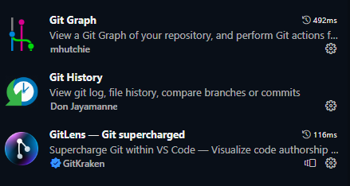
  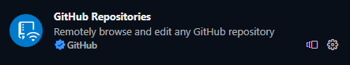
  

---

<br>
<br>

## Conceptos básicos

<br>

### ¿Qué es GIT?

**Git** es un software para el control de versiones, es distribuido, o sea que no se localiza en un solo servidor o repositorio, sino que en cualquier usuario que se sincronice tendrá disponible una copia de todo el código versionado a lo largo del tiempo en su máquina local.

En Git se trabaja con ramas, y se pueden hacer tantas ramas como sean necesarias, son livianas así que no nos preocupamos por el peso.

Git es muy bueno para código, pero no tanto para imágenes y videos.

Git es excelente, es muy fácil para trabajar y colaborar en equipo.

<br>

### ¿Por qué debemos usar Git?

Con Git evitamos perder nuestro trabajo o sobrescribir nuestro código y podemos tener múltiples puntos de “guardado”, y regresar a puntos anteriores si es necesario.

Podremos manejar conflictos cuando varios desarrolladores trabajen sobre le mismo código.

Podremos crear una rama y trabajar sobre ella (rama de desarrollo) sin miedo a mover nuestro código estable o principal (rama principal) y hacer las revisiones o correcciones necesarias antes de pasar nuestro código a la rama principal.

<br>

### Principales comandos para trabajar con Git

<br>

#### Git Init

```shell

  username@user~MINGW64~/c/00-Proyectos
  $ git init


```

**git init** convierte al directorio actual en tu máquina local en un repositorio de Git. Es una manera de inicializar un proyecto en blanco.

<br>

#### Git Clone

Es un comando para hacer una copia de un repositorio específico.

Ejemplo de la clonación de un repositorio existente en Github.

```bash

  username@user~MINGW64~/c/00-Proyectos
  $ clone https://github.com/github/my_repositorio.git


```

Cuando clonas un repositorio, obtienes toda la información de ese repositorio, ya sea los puntos de guardado (**commits**) y todas las ramas existentes con sus respectivos archivos.

Generalmente se hace eso una sola vez al comenzar a interactuar con un proyecto iniciado que ya exista en un repositorio remoto, como en GitHub.

<br>

#### Git Add

Este comando, agrega los archivos nuevos, o modificados en tu directorio de trabajo a una área llamada **stage** desde donde Git los reconocerá para poder agregar esos cambios a un punto de guardado o **commit**.

Ejemplo de agregar un archivo al **stage\*** para posteriormente realizar un punto de guardado o **commit.**

```bash

  username@user~MINGW64~/c/00-Proyectos
  $ git add README.md


```

Para agregar todos los archivos creados, modificados o borrados al área de **stage** se usa el siguiente comando:

```bash

  username@user~MINGW64~/c/00-Proyectos
  $ git add .


```

💡 **git add** es un comando importante, ningún cambio se podrá guardar en el repositorio sino a través de este comando. También es posible agregar varios archivos o todos los archivos modificados, incluso cuando se eliminan archivos, **git add** prepara esa información para el posterior **commit.**

<br>

#### Git Commit

**git commit** crea un punto de guardado, que es como una fotografía instantánea de todo un proyecto. Se realizan cuando quieres agregar nuevos archivos o archivos modificados, eliminados, pero que consideres que es un cambio necesario y “estable” a incorporar a la rama actual de trabajo. Estos puntos de guardado o **commits** pueden ser frecuentes pero siempre deben ser confirmaciones basadas en unidades básicas de cambio o sea de preferencia cambios muy concretos y muy atómicos.

Todos estos **commits** o puntos de guardado, van creando un historial a través del cual podemos ir registrando cada uno de l os cambios hechos a un proyecto. Todas estos **commits** incluyen también metadatos como un mensaje o título del **commit**, el autor, fecha, etc.

Ejemplo de un **commit**:

```bash

  username@user~MINGW64~/c/00-Proyectos
  $ git commit -m "feat: add home page h1 title"


```

Es posible agregar un comentario más explícito al **commit,** es necesario repetir la bandera **-m** y el mensaje extendido entre comillas. Ejemplo:

```bash

  username@user~MINGW64~/c/00-Proyectos
  $ git commit -m "feat: add home page h1 title" -m "this is an extended message to better explain the changes made"


```

💡 Es posible en caso de ser necesario, regresar a un **commit** anterior, pero con comandos como **git revert, git rebase, git reset** o **git reflog**. Hay que tener cuidado en utilizar estos comandos, de preferencia se usan en las ramas locales, no en las ramas sincronizadas al repositorio remoto (**main**, **dev**).

<br>

#### Git Remote

Muy ocasionalmente se usa este comando que administra el conjunto de orígenes remotos que se esta usando en el repositorio local.

```bash

  username@user~MINGW64~/c/00-Proyectos
  $ git remote -v


```

💡 hay cuatro comandos que se comunican en el remoto **git push, git clone, git pull, git fetch.** Los describiremos más adelante.

**_Ramas y el Remoto_**

No confundir el concepto de ramas (**branch**) y remoto, digamos que las ramas pueden ser locales o remotas. Git hace seguimiento de ambas y en algún punto al sincronizar el proyecto, las ramas remotas estarán emparejadas con las ramas locales asociadas.

**_Seguimiento de ramas remotas_**

**git clone [url]**: Clona (descarga) un repositorio que ya existe en GitHub u otra plataforma, incluidos todos los archivos, ramas y confirmaciones.
**git status:** este comando te muestra en qué rama se encuentra, qué archivos están en el directorio de trabajo (**stage**) y alguna otra información que puede ser importante.
**git push**: carga, empuja o sube todas las confirmaciones (**commits**) de la rama local en el repositorio remoto.
**git pull**: actualiza, jala o trae a tu rama de trabajo local actual, todas las confirmaciones (**commits**) nuevos de la rama remota. Es una combinación de **git fetch** y **git merge**.

<br>

#### Git Status

Muestra el estado actual de tu directorio de trabajo y de tu área de ensayo o **stage**. En caso de duda, es buena ida ver el estado del proyecto, este comando no modificará el proyecto, solo muestra información.

```bash

  username@user~MINGW64~/c/00-Proyectos
  $ git status

```

Dentro de la información que proporciona **git status**, podemos ver:

- Qué **commit** está a la cabeza (HEAD).
- si hay archivos modificados que aun no se hayan agregado ( **git add** ) al **stage.**
- Si la rama local actual esta desfasada de la remota.
- Si existen conflictos, **git status**, mostrará información relevante.

<br>

#### Git Pull

**git pull** actualiza la rama de trabajo local y todas las ramas que tienen seguimiento remoto.

```bash

  username@user~MINGW64~/c/00-Proyectos
  $ git pull

```

💡 Este es uno de los comandos más utilizados y es buena práctica ejecutarlo diario para mantener al día nuestro repositorio local.

<br>

#### Git Push

**git push** carga, empuja, actualiza o sube todos los **commits** de las ramas locales a las ramas remotas correspondientes.

```bash

  username@user~MINGW64~/c/00-Proyectos
  $ git push

```

💡 de forma predeterminada, **git push** solo actualiza la rama actual correspondiente, por lo que es bueno asegurarnos que estamos en la rama en la que hicimos cambios antes de empujar nuestros cambios.

<br>

#### Git Merge

Este comando es utilizado para traer, unir o fusionar los últimos cambios de una rama (**branch**) a otra, por ejemplo de esa manera podemos llevar los cambios de la rama de desarrollo a una rama de producción. Sirve para fusionar dos ramas y que esas ramas contengan la misma información.

```bash

  username@user~MINGW64~/c/00-Proyectos
  $ git merge dev

```

Para usar esta funcionalidad de Git, es necesario ubicarse en la rama destino, p.ej. “Main” o “Master” y desde ahi ejecutar el comando, indicando qué rama es que que queremos traer y fusionar a la rama destino.

<br>

#### Git Branch

Este comando gestiona las ramas, puedes listar las ramas que tienes, crear una rama nueva, cambiar de nombre.

```bash

  username@user~MINGW64~/c/00-Proyectos
  $ git branch

```

<br>

#### Git Checkout

Este comando se usa para navegar entre ramas, revisar las actualizaciones de archivos en la rama de trabajo para que coincidan con la versión almacenada de la rama.

```bash

  username@user~MINGW64~/c/00-Proyectos
  $ git checkout

```

**git checkout** funciona de la mano con **git branch** y también se puede crear una nueva rama con **git checkout** usando la bandera **-b**.

```bash

  username@user~MINGW64~/c/00-Proyectos
  $ git checkout -b ＜new-branch＞

```

---

<br>
<br>

## Nomenclatura (buenas prácticas)

<br>

### Nomenclatura de Ramas

Generalmente al inicializar un repositorio automáticamente se crea la rama principal o **master**, actualmente se está usando también el nombre de **main,** para evitar términos como master - slave (amo - esclavo )

Usaremos también una rama llamada **develop** o **dev** para nuestro ambiente de desarrollo, pueden existir tantas ramas como necesitemos, en algunas ocaciones hay ramas para **qa** (control de calidad), etc. Muchas veces vinculadas a los respectivos ambientes o entornos de trabajo (producción, desarrollo, qa, etc.).

**Prefijo:**

- **add:** Se generan una nuevas funcionalidades.
- **change:** se realizan cambios sobre funcionalidades hechas.
- **fix:** Se realizan corrección de Bugs reportados desde producción.
- **refactor:** Refactorización de funcionalidades y mejoras.
- **delete:** Se eliminan funciones o archivos.
- **doc:** Se generar cambios en la documentación.
- **hotfix:** Esta tipo se utiliza cuando prácticamente queremos introducir cambios directamente a la rama de producción.

**Esquema:**

**prefijo** + **/** (barra invertida) + **frase corta en camelCase** (todo sin espacios en blanco)

<br>

**Ejemplos:**

- add/endpointAsistentes
- change/loginForm
- doc/readmeFile
- fix/updateConfig

Pueden notar que las ramas **main** y **dev** obviamente no cambian de nombre, pero cuando desarrollamos, en nuestro caso crearemos una rama a partir de **dev** y la nombraremos según el tipo de cambio que hagamos.

<br>

### Nomenclatura de commits

Escribir buenos mensajes de **commit** es importante para que el histórico de tu proyecto sea legible, fácilmente escaneable, claro y entendible por cualquier persona que participe en el proyecto.

1. Usar un **prefijo** en los **commits** para hacerlos más semánticos seguido de dos puntos ( **:** )

   - **feat**: Una característica para el usuario.
   - **fix**: Arreglar un bug que afecta al usuario.
   - **refactor**: Refactorización del código como cambios de nombre de variables o funciones.
   - **style**: Cambios de formato, tabulaciones, espacios o puntos y coma, etc., que no afecten al usuario.
   - **perf**: Cambios que mejoran el rendimiento del sitio.
   - **build**: Cambios en el sistema de build, tareas de despliegue o instalación.
   - **ci**: Cambios en la integración continua.
   - **docs**: Cambios en la documentación.
   - **test**: Añade tests o refactoriza uno existente.

2. Usar un **verbo imperativo**

   - **add** nos indicará que se agregó uno o varios archivos o funciones.
   - **change** que se hicieron cambios en uno o más archivos o funciones.
   - **remove** nos indica que se quitó código inservible.

3. No usar punto final ni puntos suspensivos en los mensajes de un **commit**.

4. Se recomiendan mensajes cortos no más de 50 caracteres, mensaje claro, conciso. Para ello se recomienda hacer cambios atómicos, o sea no acumular muchos cambios de diferentes conceptos, y meterlos todos en un solo **commit** sino es muy recomendable dividirlos en varios **commits**.

**Esquema:**

**prefijo:** + **verbo imperativo** + **mensaje conciso**

<br>

**Ejemplo:** feat: add new search field

Nos indicaría que el **commit** se trata de una nueva funcionalidad (**feature**), en particular se agregó un campo de búsqueda.

**Ejemplo práctico:**

El cliente solicita cambios, y requiere una nueva imagen en un banner y un cambio en el tamaño de letra en un título particular.

**Solución:**

En este caso podríamos dividir nuestro desarrollo en dos **commits**, uno para el banner y otro para el cambio de estilo. Quedando de la siguiente forma:

1. feat: add new banner image
2. style: change title font size

De esta manera es muy fácil identificar en qué consistió cada uno de los commits.

---

<br>
<br>

## Ejercicios prácticos

<br>

### Iniciar un proyecto

Se puede iniciar un proyecto de varias formas, por ejemplo:

<br>

#### Inicializar un proyecto desde la terminal (git bash)

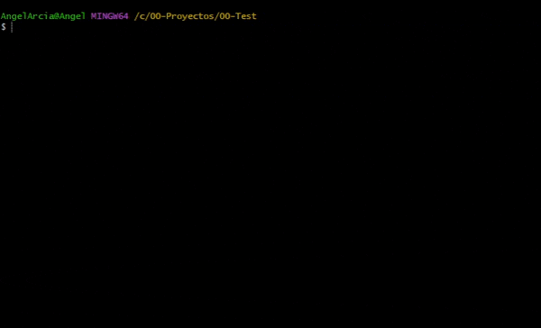

Observe como se crea automáticamente la rama **master** después de inicializar el repositorio.

> 💡 La carpeta donde se inicializa el proyecto puede estar vacía o puede contener un desarrollo ya hecho.

<br>

#### Inicializar un proyecto desde VS Code

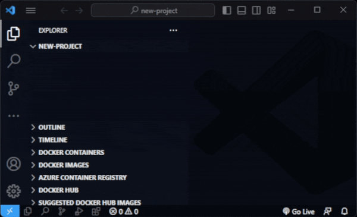

Observa como al final se activan los iconos de Git en la parte inferior de VS Code, y automáticamente se crea la rama **main.** Si observaste bien, también con las extensiones de GitHub para VS Code puedes publicar directamente el proyecto en un repositorio de GitHub.

No te olvides descargar las extensiones recomendadas para VS Code.

<br>

#### Inicializar un proyecto usando Git Tortoise

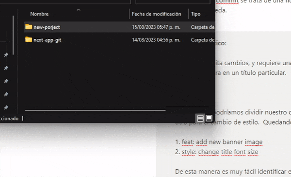

> 💡 Observa como se crea la carpeta oculta .git después de inicializar el proyecto. Esta carpeta contiene toda la información que git necesita para funcionar. **No debe borrarse nunca.**

Si un proyecto no tiene esta carpeta es porque no está versionada con git.

<br>
<br>

### Clonar un repositorio existente de GitHub en tu máquina local

<br>

#### Clonar un repositorio existente desde la terminal (git Bash)

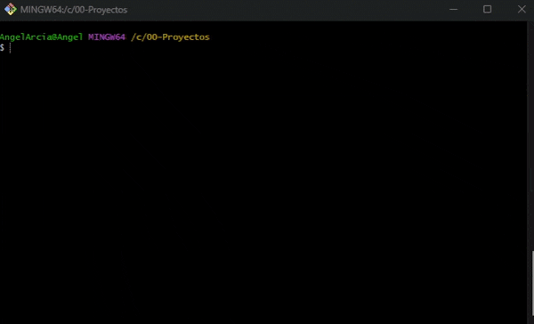

> 💡 Observa como al clonar un repositorio en una carpeta, se crea una subcarpeta con el nombre del repositorio.

<br>

#### Clonar un repositorio existente desde desde VS Code

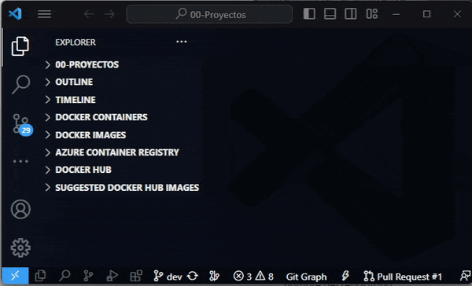

<br>

#### Clonar un repositorio existente usando Git Tortoise

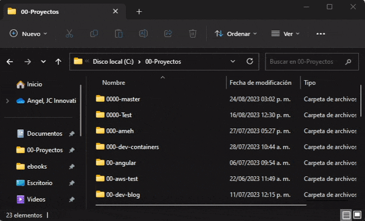

<br>
<br>

### Crear una nueva rama

En nuestro flujo diario no se trabajará sobre la rama **main** o **master**, ni sobre la rama **dev** sino que crearemos sub ramas a partir de **dev** para hacer nuestro desarrollo.

La rama **main** o **master** es usada para el ambiente de producción y **dev** para el de desarrollo, nuestros cambios se harán creando sub ramas a partir de **dev** (ver [Nomenclatura de Ramas](#nomenclatura-de-ramas) ) y es ahi donde se realizarán neustros cambios, para posterior mente llevar esos cambios a la rama **dev** y finalmente a **main o master**.

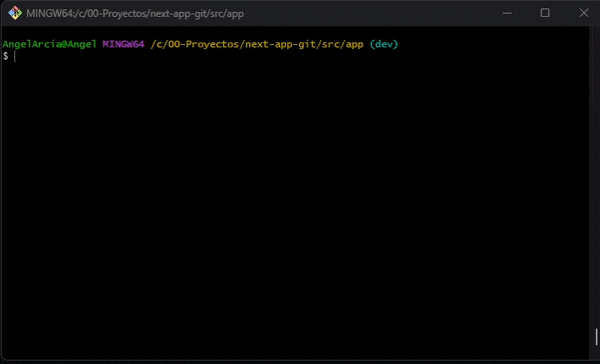

<br>

### Añadir cambios a una rama ( commit )

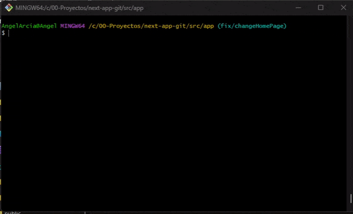

> 💡 En este ejercicio, el pequeño cambio que se agrega, utiliz un editor incluido en la terminal (nano) pero puedes ser Vim, VSCode, o el de tu preferencia.
>
> Hecho el cambio, se agrega el archivo al **stage** con **git add .** y finalmente se realiza el **commit** con su respectivo mensaje ( ver [nomenclatura de commits](https://www.notion.so/Git-Gu-a-b-sica-c250f242b47c41ee895efcba7241b6ad?pvs=21) ).

<br>
<br>

### Fusionar rama hija con rama padre (merge)

En este ejemplo vemos como para realizar un **merge,** y una vez hechos nuestros commits en la rama hija, debemos posicionarnos en la rama padre y desde ahi realizamos la fusión.

```bash

1. *(child branch)* $ git granch dev (enter)
2. *(dev)* $ git merge <child branch>

```

> 💡 Note como primero hay que viajar a la rama padre (**dev**) y desde ahi invocar el comando **merge** para llevar los cambios de la rama hija a la rama padre.

---

<br>
<br>

## Git Workflow para JC-Innovation

<br>

Una vez visto los fundamentos de Git y sus principales comandos ya podemos entender mejor como sería nuestro flujo de trabajo.

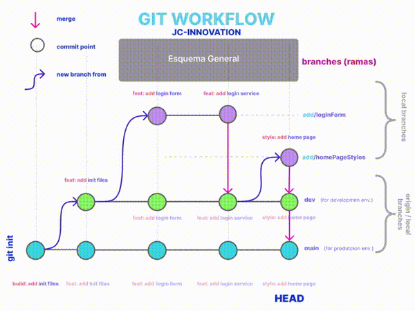

Animación que representa el avance del flujo de trabajo propuesto con GIT para JC.

<br>

### Diagrama General del flujo de trabajo en GIT para JC


En este diagrama note que las flechas curvas representan la bifurcación de ramas, no confundir con otros esquemas en donde el sentido de las flechas representa al **commit** padre.

<br>

### 1er commit en main

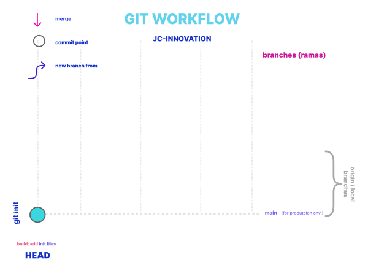

Al inicializar el repositorio la rama **main** es creada y en este caso hemos creado el primer **commit** (_build: add init files_), note que **HEAD** indiacará siempre cual es el punto de cambio o **commit** más adelantado en la línea del tiempo.l

<br>

### Creación de la rama dev y un 1er commit en ella

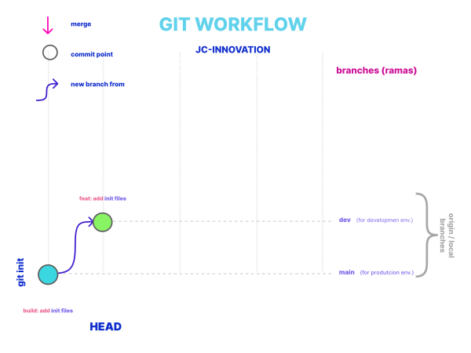

Las ramas **main** y **dev** corresponden a los ambientes **producción** y **desarrollo** respectivamente, por lo que no se hcaen commit en ellas.

<br>

### Creación de subrama de dev y un 1er commit en ella


Este es el primer cambio de desarrollo, por lo cual se crea una subrama de **dev**, es importante notar que la subrama **add/loginForm** solo existirá de manera local, no deberá sincronizarse con el repositorio remoto para evitar saturar de ramas el repositorio.

<br>

### Segundo commit en subrama de dev

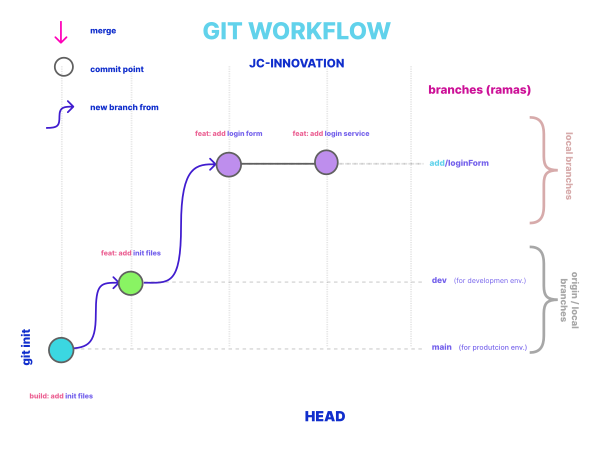

Segundo **commit** en la subrama **add/loginForm**, note como HEAD corresponde al último **commit** en la línea del tiempo, mientras que los **commit** en **main** y **dev** han quedado atrás.

<br>

### Merge hacia la rama dev de add/loginForm


En este punto se ha creado un **merge** o sea una fusión, que llevará los cambios desde la subrama **add/loginForm** a la rama de **dev**. En ese momento la rama **dev** hereda también los **commits** creados en la subrama **add/loginForm y** en seguida de hacer el **merge** se debe sincronizar la rama **dev** con el repositorio remoto, por lo que existirán **dev** y **origin dev (remoto)**, ambas estarán emparejadas y tendrán la misma información.

<br>

### Nueva subrama de dev y commit

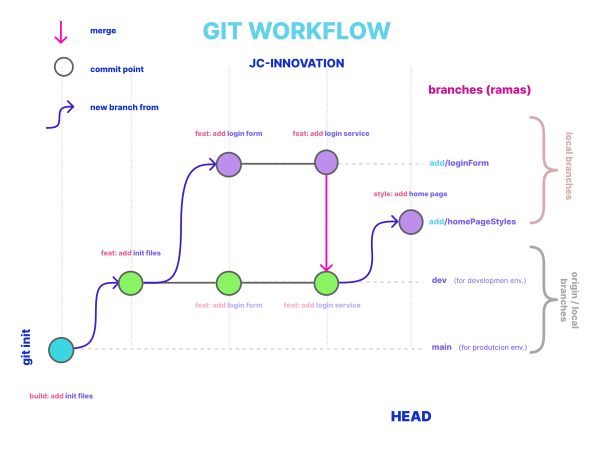

<br>

### Merge hacia dev de add/homePageStyles

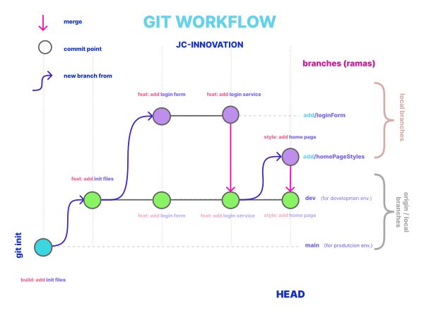

<br>

### Merge de dev hacia main

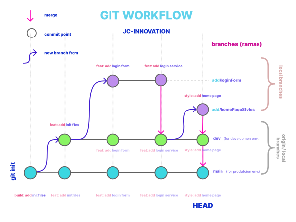

<br>

## Guías recomendadas

Esta guía es un resumen de la guía oficial de gitHub, pero es muy recomendable también la guía de atlasian y por su puesto la documentación oficial de Git.

- [Git (github.com)](https://github.com/git-guides)
- [Inicio rápido - Documentación de GitHub](https://docs.github.com/es/get-started/quickstart)
- [Git Tutorials and Training | Atlassian Git Tutorial](https://www.atlassian.com/git/tutorials)
- [How to Create a Git Repository | Atlassian Git Tutorial](https://www.atlassian.com/git/tutorials/setting-up-a-repository)
- [Git - Documentation (git-scm.com)](https://git-scm.com/doc)
- [https://midu.dev/buenas-practicas-escribir-commits-git/](https://midu.dev/buenas-practicas-escribir-commits-git/)
- [https://github.com/angular/angular/blob/22b96b9/CONTRIBUTING.md#-commit-message-guidelines](https://github.com/angular/angular/blob/22b96b9/CONTRIBUTING.md#-commit-message-guidelines)
- [https://dev.to/konami12/recomendaciones-para-el-manejo-de-ramas-3hmi](https://dev.to/konami12/recomendaciones-para-el-manejo-de-ramas-3hmi)

<!-- Scrip for make target blank  links  -->
 <script src='https://cdn.jsdelivr.net/gh/eddymens/markdown-external-link-script@v2.0.0/main.min.js'></script>
